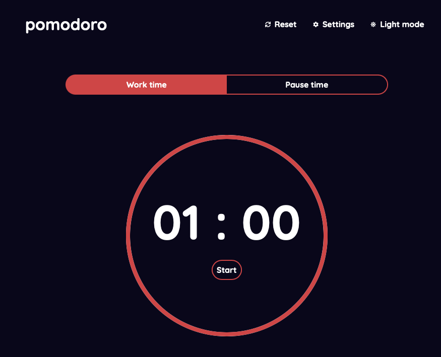

Pomodoro app made with `TypeScript`, `React`, and `Sass`. Store securely user settings in `local storage`, handle `light & dark mode`, coded with great care, even the `commit` messages are looked after.

The project is hosted by `Vercel`, you can test it by clicking on the link above, in the Github about section.

